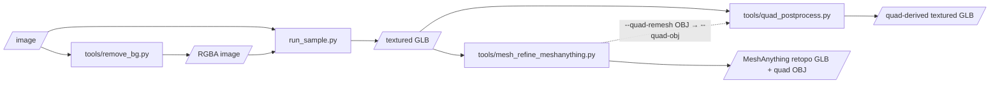

# Fork script inventory

Every script and module this fork adds on top of upstream TRELLIS.2 (`75fbf01`), grouped by the
pipeline it belongs to. For upstream files the fork only modified, run `git diff --stat --diff-filter=M 75fbf01`.

Keep this file in sync when adding or removing a script: `tests/test_inventory.py` fails if a
file in `tools/`, a root `*.py`, or a module in `trellis2/utils/` isn't mentioned here.

Status: **works** = run on ROCm in this fork's dev notes or the cleanup validation · **untested** = no recorded run · **dev** = debugging aid.

## Pipelines at a glance

The three CLIs are independent: each reads files and writes files, and nothing chains them
automatically.

## 1. Generation: image → GLB

| File | Role | What it does | Needs | Status |
|---|---|---|---|---|
| `run_sample.py` | entry point | Image → (background removal) → `Trellis2ImageTo3DPipeline` → `o_voxel.postprocess.to_glb` → GLB. Flags: `--image --output --texture-size --decimation --no-glb --no-remove-bg`. Opts in to `TRELLIS2_UNGATED_MODELS`. | TRELLIS.2-4B, BiRefNet, DINOv3 (ungated re-upload) | works |
| `tools/remove_bg.py` | CLI | Standalone background removal + centering: `input.png output.png`. | BiRefNet | works |
| `trellis2/pipelines/rembg/centered.py` | library | `remove_background(img)`: BiRefNet mask (GPU, CPU retry) with flood-fill fallback, subject centered on a 1024² RGBA canvas. Shared by the two scripts above. | upstream `rembg/BiRefNet.py` | works |
| `o-voxel/o_voxel/uv_rasterize.py` | library | Pure-PyTorch UV-space rasterize/interpolate, replacing nvdiffrast for texture baking on ROCm. Used by `o_voxel.postprocess.to_glb`, `Trellis2TexturingPipeline`, `quad_postprocess.transfer_texture`. | — | works |
| `trellis2/modules/sparse/attention/sdpa_varlen.py` | library | Variable-length attention via PyTorch SDPA (`ATTN_BACKEND=sdpa`); fallback when flash-attn is unavailable. | — | untested (flash_attn is the default) |

## 2. Quad post-processing: GLB → quad-derived textured GLB

Entry point: **`tools/quad_postprocess.py`** (`--input --output`, plus `--source direct|meshanything`,
`--quad-obj`, `--no-alpha-wrap`, `--subdivide-levels`, `--adaptive`, `--debug-dir`, …).
Pipeline: repair → Alpha Wrap (watertight) → QuadriFlow → snap to reference → separatrix
patches → UV unwrap → texture transfer → GLB. Design and results: `quadriflow_postprocess_plan.md`.

| Module | What it does | Needs | Status |
|---|---|---|---|
| `trellis2/utils/quad_remesh.py` | `remesh_to_quad_dominant_obj[_multi_component]`: QuadriFlow remesh to a quad OBJ. | `quadriflow_ext` (third_party/QuadriFlow) or its CLI | works |
| `trellis2/utils/alpha_wrap.py` | `alpha_wrap_mesh`: CGAL Alpha Wrap to a watertight surface. | `alpha_wrap_ext` or `third_party/AlphaWrap/build/alpha_wrap` | works |
| `trellis2/utils/quad_postprocess.py` | Quad OBJ I/O, `quad_fraction`, snap-to-reference, separatrix tracing, patch-based and auto UV unwrap, `transfer_texture`. | `cumesh`, `o_voxel.uv_rasterize` | works |
| `trellis2/utils/mesh_repair.py` | Island removal, non-manifold face removal, winding checks, `repair_mesh[_after_decimation]`. | `open3d` | works |
| `trellis2/utils/curvature.py` | `compute_rho`: curvature-based density field for adaptive QuadriFlow. | — | works |
| `trellis2/utils/subdivision.py` | `subdivide_catmull_clark` (n-gon aware). | `pymeshlab` | works |
| `trellis2/utils/quad_debug.py` | dev: quad wireframe renders / contact sheets for `--debug-dir`. | `mesh_rasterizer` | dev |
| `trellis2/utils/mesh_debug.py` | dev: per-stage mesh / point-cloud dumps + contact sheets for `--debug-dir`. | `mesh_rasterizer` | dev |

## 3. MeshAnything refinement: GLB → artist-style retopology

Entry point: **`tools/mesh_refine_meshanything.py`** (`--input --output`, `--algo legacy|direct-sample`,
`--reference-image`, `--skip-sds`, `--sampling`, `--quad-remesh OUT.obj`, `--debug-dir`, …).
Also reachable from `tools/quad_postprocess.py --source meshanything`. Design: `mesh_improvements.md`.

| Module | What it does | Needs | Status |
|---|---|---|---|
| `trellis2/utils/meshanything_bridge.py` | MeshAnythingV2 loading/inference, conditioning point-cloud sampling, `refine_mesh_coarse` (legacy, SDS → MeshAnything) and `refine_mesh_direct_sample`. | `third_party/MeshAnythingV2`, `Yiwen-ntu/meshanythingv2` | works (slow: ~5 min/asset; not the quad default) |
| `trellis2/utils/sds_geometry_refine.py` | `refine_geometry`: SDS-guided vertex-offset optimization against a reference image. | `lambdalabs/sd-image-variations-diffusers`, `openai/clip-vit-large-patch14` | works (legacy path only) |
| `trellis2/utils/mesh_rasterizer.py` | Pure-PyTorch mesh renderer (normals/depth). Visibility is rasterized without gradients; shading is differentiable, which SDS relies on. Also used for debug renders. | — | works |

## 4. Development checks

`tests/phase/test_phase*.py`: pytest-style checks written phase by phase for the MeshAnything /
SDS work (section 3). Run from the repo root: `python -m pytest tests/phase`. They need the GPU
and the models above. Phase 3/5 read `samples/can.{glb,png}`, which are local and untracked.
Nothing here covers the quad pipeline (section 2).

| File | Covers |
|---|---|
| `test_phase1.py`, `test_phase1_bbox.py` | MeshAnything inference on an icosphere (output shape; prints output bbox) |
| `test_phase2.py` | `mesh_rasterizer` renders |
| `test_phase3.py`, `test_phase3_nan_guard.py` | `sds_geometry_refine` on `can.glb`; NaN guard |
| `test_phase4.py` | Conditioning point-cloud normalization and its inverse round-trip on an off-center box |
| `test_phase5.py` | `refine_mesh_coarse` end to end |

## 5. Build and setup

| File | What it does |
|---|---|
| `setup.sh` (modified) | Upstream installer; CuMesh/FlexGEMM install from the vendored copies in this repo instead of upstream git. |
| `build_pytorch.sh` | Builds PyTorch from source for gfx1151. |
| `third_party/AlphaWrap/` | CGAL Alpha Wrap CLI + `alpha_wrap_ext` binding; see `BUILD_NOTES.md`. |
| `third_party/QuadriFlow/` | QuadriFlow + `quadriflow_ext` binding. |
| `third_party/MeshAnythingV2/` | Vendored MeshAnythingV2, patched for transformers ≥ 5. |

## Environment variables

| Variable | Default | Set by | Effect |
|---|---|---|---|
| `FLASH_ATTENTION_TRITON_AMD_ENABLE` | `TRUE` on ROCm | `trellis2/__init__.py` | flash-attn uses its Triton backend (no HIP binary for gfx1151). |
| `MIOPEN_DEBUG_CONV_WINOGRAD` | `0` on ROCm | `trellis2/__init__.py` | Avoids MIOpen Winograd kernel load failures on gfx1151. |
| `TRELLIS2_UNGATED_MODELS` | unset (`1` in `run_sample.py`) | entry point | Swap gated DINOv3 / RMBG-2.0 for ungated substitutes. |
| `ATTN_BACKEND` | `flash_attn` | user | `flash_attn`, `sdpa`, `xformers`, … |

`FLEX_GEMM_ALGO` (`explicit_gemm` on ROCm) is a module constant in `trellis2/modules/sparse/conv/config.py`, not an env var.
